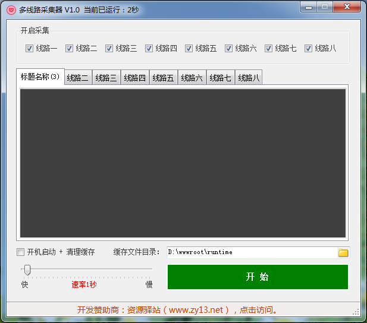

# 多线路采集器
### 开发语言：C#
### 开发工具：Microsoft Visual Studio 2010
## 软件简述：
多线程采集，可以自定义URL链接，适用于各种爬虫获取数据，开机启动，占用资源极小。
## 使用方法：
1. 软件根目录下一共有1.txt、2.txt、3.txt ... 共8个txt配置文件，分别对应一个线路，配置文件格式如下：
```txt
# 标题名称
采集地址1 ===> 例如 http://127.0.0.1/caiji.php?type=1
采集地址2 ===> 例如 http://127.0.0.1/caiji.php?type=2
采集地址3 ===> 例如 http://127.0.0.1/caiji.php?type=3
```
2. 软件只是定时执行Http请求（GET），获取数据、写入数据库等功能是由你调用的URL链接来实现。
## 软件截图：

